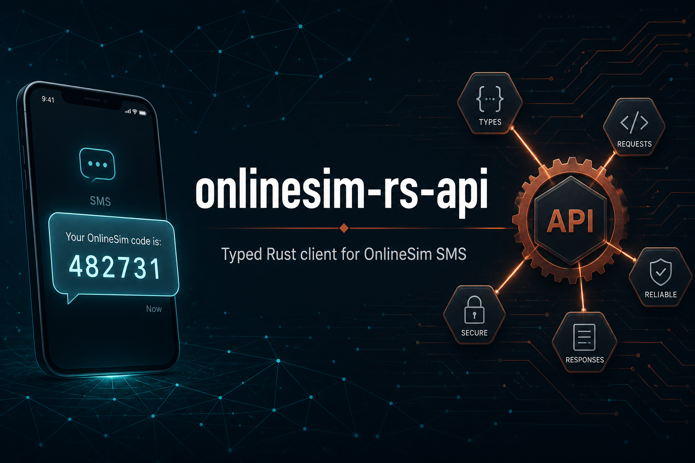

[](https://crates.io/crates/onlinesim-rs-api)
[](https://docs.rs/onlinesim-rs-api)
[](https://github.com/s00d/onlinesim-rs-api/issues)
[](https://github.com/s00d/onlinesim-rs-api/stargazers)
[](https://www.donationalerts.com/r/s00d88)

<p align="center">
  
</p>

# onlinesim-rs-api

Rust client for [OnlineSim](https://onlinesim.io) SMS API with full serde typing, async and blocking clients, and a built-in mock server for tests.

## Features

| Feature | Default | Description |
|---------|---------|-------------|
| `async` | yes | Async `Client` (`reqwest` + `tokio`) |
| `blocking` | no | Sync `blocking::Client` |
| `mock` | no | Built-in `MockOnlineSim` HTTP mock for tests / local integration |

## Install

```toml
[dependencies]
onlinesim-rs-api = "0.1"

[dev-dependencies]
onlinesim-rs-api = { version = "0.1", features = ["mock"] }
tokio = { version = "1", features = ["rt-multi-thread", "macros"] }
```

## Quick start (async)

```rust
use onlinesim_rs_api::Client;

#[tokio::main]
async fn main() -> onlinesim_rs_api::Result<()> {
    let client = Client::new("your-apikey")?;
    let balance = client.user().balance().await?;
    println!("balance = {}", balance.balance);

    let tzid = client.numbers().get("telegram").await?;
    println!("tzid = {tzid}");
    Ok(())
}
```

## Webhooks

OnlineSim can `POST` JSON to your URL when an SMS arrives (temporary numbers and rent).

```rust
use onlinesim_rs_api::{parse_webhook_json, Client};

#[tokio::main]
async fn main() -> onlinesim_rs_api::Result<()> {
    let client = Client::new("your-apikey")?;

    // Save URL on the profile (also applied to active receive/rent ops).
    client
        .user()
        .set_webhook_url(Some("https://example.com/hooks/sms"))
        .await?;

    // In your HTTP handler:
    let body = r#"{"user_id":1,"country_code":1,"number":"+19001234567","sender":"Telegram","message":"code 123456","time_start":"2026-01-01 00:00:00","time_left":10,"operation_id":1000,"webhook_type":"receiving_sms","code":"123456"}"#;
    let payload = parse_webhook_json(body)?;
    assert_eq!(payload.code, "123456");

    let logs = client.user().webhook_logs(1).await?;
    println!("{} delivery log(s)", logs.data.len());
    Ok(())
}
```

Respond with **HTTP 200**. Payload fields may be numbers or strings; `WebhookPayload` / `parse_webhook_json` accept both, and also `{ "data": { ... } }` wraps.

| Method | Purpose |
|--------|---------|
| `user().set_webhook_url(Some(url))` | Enable / change webhook |
| `user().clear_webhook_url()` | Disable |
| `user().webhook_logs(page)` | Delivery history |
| `parse_webhook_json` / `WebhookPayload` | Parse inbound POST body |

## Built-in mocks (no real numbers)

```rust
use onlinesim_rs_api::mock::{MockOnlineSim, SmsScript};
use onlinesim_rs_api::WaitCodeOptions;

#[tokio::main]
async fn main() -> onlinesim_rs_api::Result<()> {
    let mock = MockOnlineSim::start().await;
    mock.script_sms(SmsScript {
        code: "123456".into(),
        polls_before_code: 1,
        ..SmsScript::default()
    });

    let client = mock.client()?;
    let ordered = client.numbers().get_with_number("telegram").await?;
    let code = client
        .numbers()
        .wait_code(
            ordered.tzid,
            WaitCodeOptions {
                interval_secs: 0, // no sleep in tests
                ..WaitCodeOptions::default()
            },
        )
        .await?;
    assert_eq!(code, "123456");
    Ok(())
}
```

See module docs: [`onlinesim_rs_api::mock`](https://docs.rs/onlinesim-rs-api/latest/onlinesim_rs_api/mock/) and example:

```bash
cargo run --example mock_sms_flow --features mock
```

### Mock helpers

| Method | Purpose |
|--------|---------|
| `script_sms(SmsScript)` | Queue number + SMS code delivery |
| `fail_no_number(service)` | Force `NO_NUMBER` on `getNum` |
| `set_balance(...)` | Control `getBalance` |
| `client()` | Preconfigured `Client` pointed at the mock |

Covered endpoints include: `getBalance`, `getProfile`, `profile` (webhook save), `webhook-logs`, `getNum`, `getState`, `setOperationOk` / `Revise`, `getPrice`, `getNumbersStats`, free-list endpoints, rent get/state/close/tariffs.

## API modules

| Method | Module |
|--------|--------|
| `client.numbers()` | Temporary SMS numbers |
| `client.rent()` | Long-term number rent |
| `client.user()` | Balance / profile / payments / webhooks |
| `client.free()` | Public free numbers |

## Examples

```bash
ONLINESIM_APIKEY=... cargo run --example get_balance
ONLINESIM_APIKEY=... cargo run --example wait_sms
cargo run --example mock_sms_flow --features mock
```

## Testing

HTTP integration tests use the same published [`mock`](https://docs.rs/onlinesim-rs-api/latest/onlinesim_rs_api/mock/) module that downstream crates depend on — not ad-hoc servers.

```bash
cargo test --features "mock,blocking"
```

## License

Apache License 2.0
